# Pokémon Mini Games

A collection of three Pokémon-themed browser games: a memory card game, a Tic-Tac-Toe game with an AI opponent powered by Google Gemini, and a Wordle-style guessing game.

🔗 **Live demo:** https://pokemon-mini-games.onrender.com

---

## How to Run

**Prerequisites:** Node.js installed.

1. Install dependencies:
   ```bash
   npm install
   ```

2. Create a `.env` file in the project root:
   ```
   GEMINI_API_KEY=your_api_key_here
   PORT=3000
   ```

3. Start the server:
   ```bash
   npm start
   ```

4. Open your browser and go to `http://localhost:3000`

---

## Games

### Homepage (`index.html`)

The landing page — a card per game, each with a looping CSS animation preview that demonstrates how that game actually plays before you click in.

**Features:**
- TicTacToe card: pieces pop into place on the board one at a time, on a loop
- Memory game card: cards flip in sequence to preview the matching gameplay
- Wordle card: letters pop in and colour in (green/yellow/grey) to preview a sample guess, finishing with the correct answer revealed
- All animations are pure CSS `@keyframes`, synced to a shared timeline
- Each card is a clickable link straight into that game
- Responsive layout — cards stack on small/medium screens, sit side-by-side on large screens

| Desktop | Mobile |
|---|---|
| 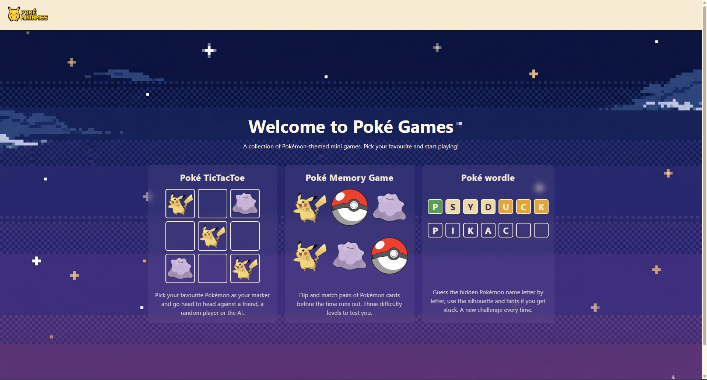 | 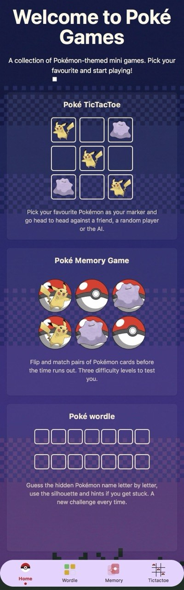 |

---

### Pokémon Memory Card Game (`memory.html`)

A classic flip-and-match memory game using Pokémon artwork fetched from the PokéAPI.

**Features:**
- Three difficulty levels: Easy (3 pairs), Medium (6 pairs), Hard (12 pairs)
- Pokémon images are fetched randomly and uniquely from the PokéAPI using `axios`
- Flip animation with 3D card effect
- Power-up: briefly reveals all cards
- Timer that counts down — game ends if time runs out
- Tracks clicks, pairs matched, and pairs remaining in real time
- Dark/light theme toggle

| Desktop | Mobile |
|---|---|
| 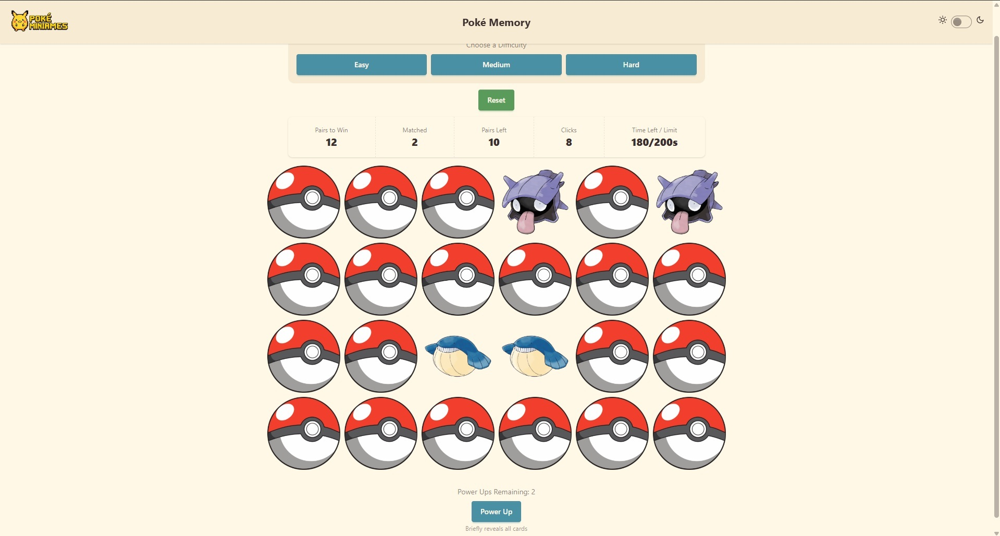 | 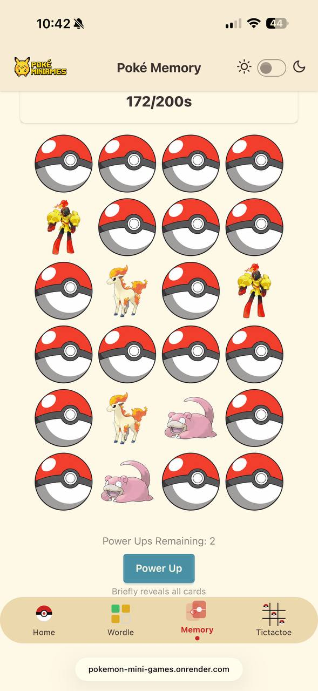 |

---

### Pokémon TicTacToe (`tictactoe.html`)

A Tic-Tac-Toe game where each player picks a Pokémon as their marker, with three play modes.

**Features:**
- **Local mode** — two players take turns on the same device
- **AI mode** — play against Google Gemini, which picks its own Pokémon marker and plays strategically
- **Online mode** — real-time multiplayer via Socket.IO; join a random opponent or a specific room by ID, with duplicate-marker prevention and disconnect handling
- Rematch flow for online mode — request, accept, or decline another round, with turn order alternating fairly each round
- Players pick their name and search for any Pokémon as their marker
- Winning cells are highlighted on win
- Confetti celebration on win
- **New Round** — clears the board, keeps scores and player selections
- **New Game** — resets everything back to player selection
- Win counter tracks scores across rounds
- Dark/light theme toggle

| Player Selection | VS AI (mobile) |
|---|---|
| 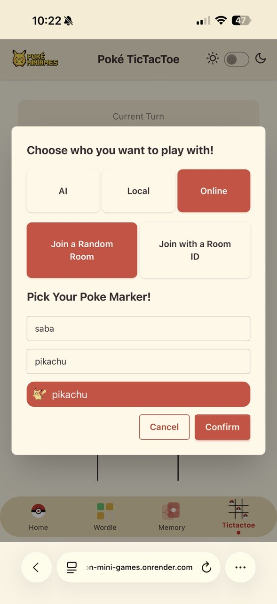 | 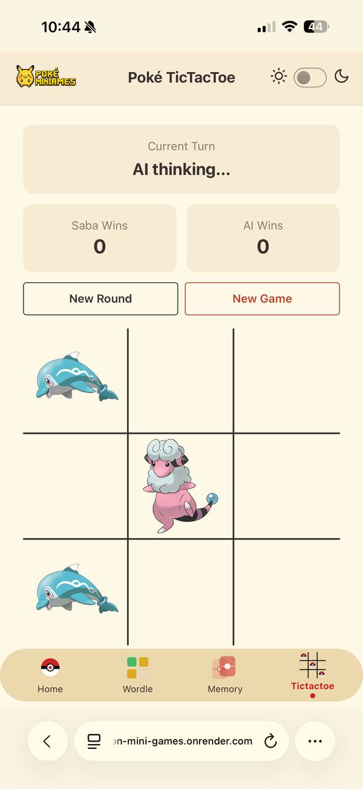 |

| Online mid-game (mobile) | Online win (desktop) |
|---|---|
| 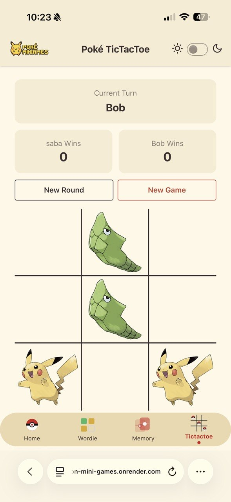 | 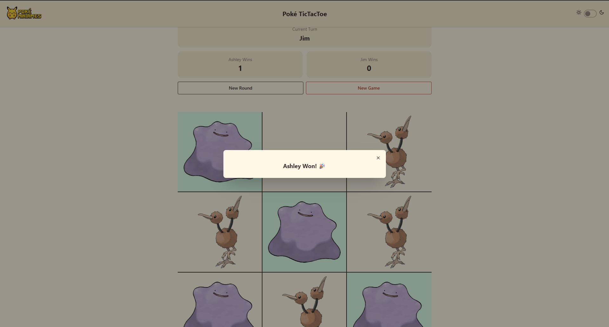 |

---

### Pokémon Wordle (`pokewordle.html`)

A Wordle-style game where the hidden word is always a Pokémon name.

**Features:**
- Random Pokémon fetched from the PokéAPI — grid width matches the Pokémon's name length
- 6 attempts to guess the name, with colour-coded feedback per letter (green = correct position, yellow = wrong position, grey = not in name)
- 3 progressive hints: Pokémon type → colour → abilities
- Pokémon silhouette shown as a shadow, revealed on win or loss
- Shake animation on invalid guess submission
- Confetti celebration on win
- Works on both desktop (keyboard) and mobile (on-screen input)
- Dark/light theme toggle

| Mid-game (desktop) | Hints revealed (mobile) |
|---|---|
| 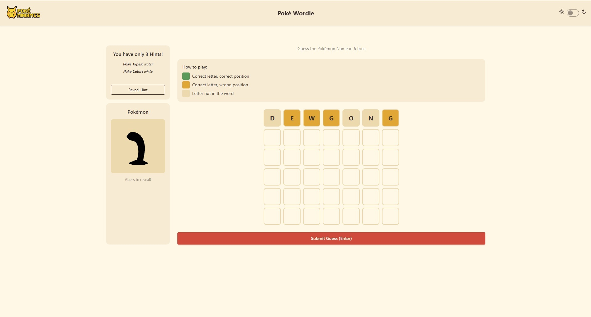 | 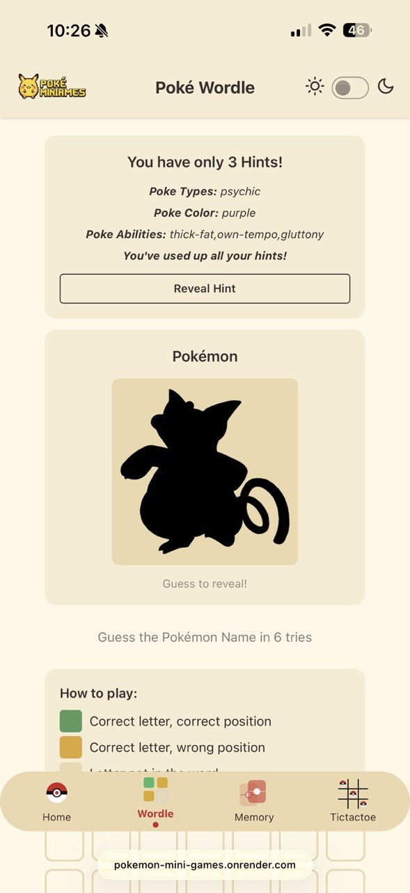 |

| Win state (desktop) | Win state (mobile) |
|---|---|
| 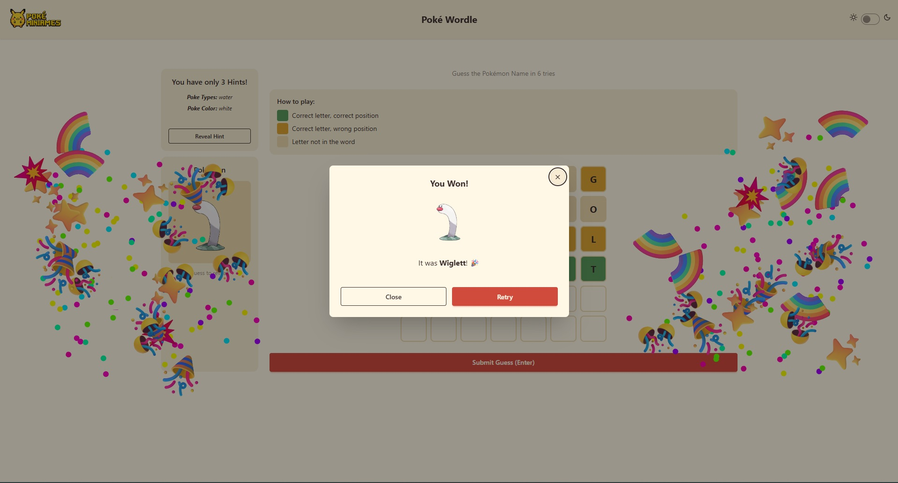 | 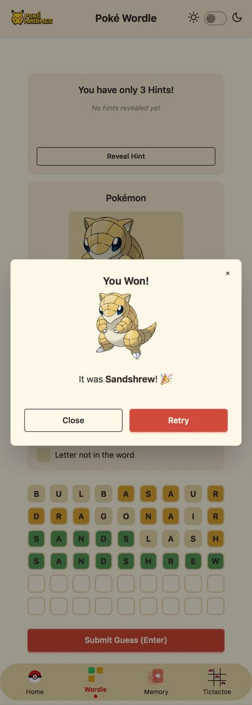 |

---

## Tech Stack

| Layer | Technologies |
|---|---|
| Frontend | HTML, Tailwind CSS v4, DaisyUI v5, CSS `@keyframes` animations |
| Backend | Node.js, Express, Socket.IO |
| APIs | PokéAPI (Pokémon data), Google Gemini (`gemini-2.0-flash-lite`) for AI opponent |
| Libraries | axios, dotenv, js-confetti, cors, `@google/genai` |
